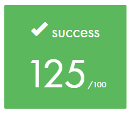

# Libft

Code a set of standard library functions to be used in future projects.

For more detail including function descriptions, please view the file **libft - project description.pdf**.

## Objective

C programming can be very tedious when one doesn’t have access to those highly useful
standard functions. This project makes you to take the time to re-write those functions,
understand them, and learn to use them. This library will help you for all your future C
projects.

